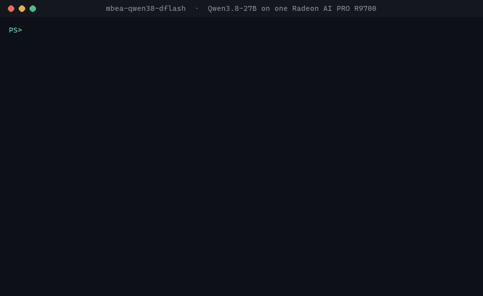

# mbea-qwen38-dflash

**Qwen3.8-27B at 125–134 tokens/s with up to 260k context on a single AMD Radeon AI PRO R9700, running on Windows.**

A tuned, reproducible vLLM serving setup for one R9700 (RDNA4, gfx1201, 32 GB) under Windows 11 + WSL2. It uses AMD's official MXFP4 checkpoint, a DFlash2 speculative drafter and the RDNA4 kernels from [radiance](https://codeberg.org/ggz14/radiance-vllm-mxfp4). One command installs everything, one starts an OpenAI-compatible server.




<sub>Real output from one R9700. The code stream plays at its recorded speed (548 tokens, 170 tok/s; short answers with reasoning off decode faster than the long benchmark runs). The 166 s model load and the 5-minute benchmark are skipped. The generated code compiles and passes its own 3 tests.</sub>

---

## Performance

Measured on one R9700 32 GB, Ryzen 9 9950X, 96 GB RAM, Windows 11 + WSL2, AMD Software PRO 26.7.1.
Every number is a median of repeated runs on the shipped profile; method and raw tables in [docs/BENCHMARKS.md](docs/BENCHMARKS.md).

| | Result |
|---|---|
| **Decode, greedy** | **125–134 tok/s** (medians of three separate starts) |
| **Decode, sampled** (temp 0.7, top-p 0.95) | **117–126 tok/s** |
| **Prefill, 1.9k-token prompt** | **2,750–2,970 tok/s**, time to first token 0.66–0.70 s |
| **Prefill, long prompts** | 32k in 10.9 s · 98k in 41 s · 164k in 83 s · 258k in 164 s |
| **Decode deep in context** | 165 tok/s at 32k · 136 at 98k · 145 at 164k · 115 at 258k |
| **Context window** | ~216k tokens by default · **~260k with `-Long`** (the model's 262k limit) |
| **Draft acceptance** | 59–63 % of drafted tokens · 5.1–5.4 tokens per verify step |
| **Long-context recall** | 8/8 facts retrieved from a 257,768-token prompt |
| **Coding quality** | 10 of 12 runs pass all 46 tests on a 1.9k-token Rust spec |
| **Load time** | ~2.5–3 min (the one-time kernel compile is done during `install`) |

A clean install from this repository, then `.\qwen38.ps1 bench`, reproduced the setup on the same box (2026-10-08):

| Test | Prompt tokens | Prefill tok/s | TTFT s | Decode tok/s | Draft acceptance |
|---|---:|---:|---:|---:|---:|
| Coding task, greedy (x3) | 1,920 | 2,744 | 0.70 | 125.3 | 61.9% |
| Coding task, sampled (x3) | 1,921 | 2,757 | 0.70 | 116.7 | 58.2% |
| Long prompt (~32k) | 34,741 | 2,762 | 12.58 | 138.4 | - |

For reference, the same model in a tuned llama.cpp build (IQ4_XS GGUF, MTP + n-gram speculation) decodes at 52–68 tok/s on this card. That was measured with a different prompt, so treat it as a rough comparison.

### Where the speed comes from

| Technique | Effect |
|---|---|
| **DFlash2 drafter** ([tcclaviger/Qwen3.8-27B-DFlash2-FP8](https://huggingface.co/tcclaviger/Qwen3.8-27B-DFlash2-FP8)) drafts 7 tokens per step | ~5.3 tokens accepted per forward pass of the 27B model |
| **Draft re-ranking + dedicated verify head** (`RADIANCE_DRAFT_RERANK=80`, `RADIANCE_VERIFY_HEAD=1`) | +7 % decode, acceptance unchanged |
| **MXFP4 weights through a hand-written W4A8 GEMM** for gfx1201 | 4-bit weights without vLLM's emulation path |
| **libr4d** FP8 paged attention + gated-delta-net kernels (pinned `b9e42ab` + rx9 narrow-state patch) | the stock kernel NaNs this model; this one is fast and correct |
| **WSL pinned-memory fix** | host→device copies become async (a 4-byte copy cost ~17 ms before) |
| **Free-VRAM budgeting at startup** | uses all VRAM Windows isn't holding, without paging through host memory |
| **Vision tower skipped** (`language_model_only`) | ~1 GiB more KV cache |

---

## Requirements

| | |
|---|---|
| **GPU** | AMD Radeon AI PRO R9700 (gfx1201). Other cards are not supported: the kernels are compiled for gfx1201 only |
| **OS** | Windows 11 with WSL2 (`wsl --update` recommended) |
| **Driver** | AMD Software: PRO Edition with WSL support (tested: 26.7.1) |
| **Disk** | ~45 GB free for the WSL distro (19 GB model, 2 GB drafter, 14 GB image, caches) |
| **RAM** | 32 GB minimum, 64 GB+ recommended (tested with 96 GB) |
| **Network** | ~35 GB of downloads on first install |

Nothing else needs to be preinstalled. The installer sets up Ubuntu 24.04, Docker and ROCDXG inside WSL. ROCDXG is AMD's bridge that lets ROCm reach the GPU from WSL. The full ROCm stack is not needed on the host because it ships inside the container.

## Quick start

From PowerShell:

```powershell
git clone https://github.com/mike2153/mbea-qwen38-dflash
cd mbea-qwen38-dflash
.\qwen38.ps1 install      # one-time, ~30-60 min: ~35 GB of downloads + kernel builds
.\qwen38.ps1 start        # ready on http://localhost:8080/v1
```

If WSL isn't installed yet, `install` sets it up first. Create your Linux user when Ubuntu asks, then run `install` again.

> Running scripts blocked? Use `powershell -ExecutionPolicy Bypass -File .\qwen38.ps1 install`.

### Commands

| Command | What it does |
|---|---|
| `.\qwen38.ps1 install` | One-time setup. Safe to re-run: finished steps are skipped and downloads resume |
| `.\qwen38.ps1 start` | Starts the server and waits until it's ready (~216k context) |
| `.\qwen38.ps1 start -Long` | Leaves 1.0 GiB for Windows instead of 1.5 GiB. Gives ~260k context, but close browsers and other GPU apps first |
| `.\qwen38.ps1 status` | Container state, endpoint and actual context window |
| `.\qwen38.ps1 bench` | Measures prefill, decode and draft acceptance on your box (~5 min) |
| `.\qwen38.ps1 logs` | Follows the server log |
| `.\qwen38.ps1 stop` | Stops and removes the container. Models and caches stay |

Already in WSL? `scripts/qwen38.sh setup|start [--long]|stop|status|logs` does the same thing as root.

## Using it

It's a standard OpenAI-compatible endpoint. The model name is `Qwen3.8-DFlash`.

```bash
curl http://localhost:8080/v1/chat/completions -H "Content-Type: application/json" -d '{
  "model": "Qwen3.8-DFlash",
  "messages": [{"role": "user", "content": "Write a Rust function that reverses a linked list."}]
}'
```

- **Reasoning** is on by default and is returned in `reasoning_content`. Turn it off per request with `"chat_template_kwargs": {"enable_thinking": false}`.
- **Tool calls** work out of the box (`qwen3_coder` parser, auto tool choice), so agents such as Codex, opencode, Cline and Continue can use it as an OpenAI-compatible provider. Use base URL `http://localhost:8080/v1` and any API key.
- **Defaults**: temperature 0.7, top-p 0.95, top-k 20. Requests can override them.
- **One request at a time** (`--max-num-seqs 1`). This setup is tuned for a single fast agent, not many users at once.

## Configuration

Set these in WSL before `qwen38.sh`, or pass them through `wsl -u root -- env VAR=... bash scripts/qwen38.sh ...`:

| Variable | Default | Meaning |
|---|---|---|
| `VRAM_RESERVE_GIB` | `1.5` | VRAM left free for Windows. Lower means more context |
| `VRAM_CAP` | `0.90` | Most of the card vLLM may take. `start -Long` sets 1.0 / 0.95 |
| `PORT` | `8080` | Server port |
| `MODELS` | `/root/models` | Where the checkpoints live in WSL |
| `QWEN38_DATA` | `/root/qwen38-dflash` | Radiance checkout, libr4d build, compile caches |
| `HF_TOKEN` | unset | Only needed if Hugging Face rate-limits you |

The tuned engine settings live in [`config/dflash.env`](config/dflash.env), and the vLLM arguments are in `cmd_start` in [`scripts/qwen38.sh`](scripts/qwen38.sh).

The context window is sized from free VRAM at each start. If Windows apps hold more VRAM, the window gets smaller. That's the trade for never paging through host memory, which drops decode to around 10 tok/s.

## What `install` does

| Step | |
|---|---|
| 1. Host check | WSL2 GPU bridge (`/dev/dxg`) and free disk |
| 2. Packages | `git`, `curl`, `python3`, `docker.io` inside Ubuntu |
| 3. ROCDXG | [`rocdxg-roct` 1.2.2](https://github.com/ROCm/librocdxg/releases), which lets ROCm reach the GPU through WSL |
| 4. Image | `stilldeadcode/vllm-radiance:0.9.3`, pinned by digest |
| 5. GPU check | Confirms the container sees a gfx1201 GPU before downloading anything large |
| 6. Runtime | Clones [radiance](https://codeberg.org/ggz14/radiance-vllm-mxfp4) at commit `7d9a15a` and applies [`patches/radiance-wsl-r9700.patch`](patches/radiance-wsl-r9700.patch) (WSL GPU detection, pinned memory, VRAM budgeting) |
| 7. Models | [`amd/Qwen3.8-27B-Quark-AWQ-MXFP4`](https://huggingface.co/amd/Qwen3.8-27B-Quark-AWQ-MXFP4) and the DFlash2-FP8 drafter at pinned revisions, then a one-line config fix ([`scripts/fix_checkpoint.py`](scripts/fix_checkpoint.py)) instead of upstream's 15-minute re-quantisation |
| 8. Kernels | Builds libr4d `b9e42ab` + the rx9 patch inside the image |
| 9. First start | Starts and stops the server once to fill the Triton/inductor cache. A cold start's autotuning buffers inflate vLLM's memory profile and would cut the first window to ~100k tokens |

Every version is pinned (image digest, git commits, Hugging Face revisions), so a fresh install reproduces the measured setup.

## Troubleshooting

| Symptom | Fix |
|---|---|
| `/dev/dxg is missing` | Install or update the AMD Windows driver, then run `wsl --update` and `wsl --shutdown` |
| GPU check fails: `no GPU visible` | Run `wsl --shutdown` and retry. Make sure no other WSL distro or app holds the GPU exclusively |
| `docker is installed but not running` | Enable systemd: add `[boot]` and `systemd=true` to `/etc/wsl.conf`, then run `wsl --shutdown` |
| Container exits with `Insufficient free VRAM` | Close GPU-heavy apps (browsers, games) or move a second monitor to the iGPU |
| Decode suddenly ~10 tok/s | VRAM spilled into shared memory. `stop`, free VRAM, then `start` without `-Long` |
| Port 8080 already in use | `PORT=8090` (see Configuration) |
| Want the disk space back | `.\qwen38.ps1 stop`, then in WSL `rm -rf /root/qwen38-dflash /root/models/*Qwen3.8*` and `docker rmi stilldeadcode/vllm-radiance:0.9.3` |

## Repository layout

```
qwen38.ps1                    Windows entry point (install / start / stop / status / logs / bench)
scripts/qwen38.sh             everything that runs in WSL: setup and container lifecycle
scripts/entry.sh              runs inside the container: patch chain, kernel build, launch
scripts/fix_checkpoint.py     makes AMD's checkpoint loadable without rewriting weights
config/dflash.env             the tuned engine profile
patches/radiance-wsl-r9700.patch   local changes on top of the pinned radiance commit
bench/                        stdlib benchmark + the coding prompt used for the published numbers
docs/BENCHMARKS.md            full measurements and method
```

## Credits

This repository is packaging and tuning. The hard parts are other people's work:

- **[radiance-vllm-mxfp4](https://codeberg.org/ggz14/radiance-vllm-mxfp4)** (ggz14) and **[vllm-radiance](https://codeberg.org/StillDeadcode/vllm-radiance)** / **[libr4d](https://codeberg.org/StillDeadcode/libr4d)** (StillDeadcode): the RDNA4 vLLM stack, MXFP4 path, DFlash integration and kernels
- **[AMD](https://huggingface.co/amd/Qwen3.8-27B-Quark-AWQ-MXFP4)**: the Quark MXFP4 checkpoint (Apache-2.0)
- **[tcclaviger](https://huggingface.co/tcclaviger/Qwen3.8-27B-DFlash2-FP8)**: the DFlash2 FP8 drafter
- **[Qwen](https://huggingface.co/Qwen)**: Qwen3.8
- **[vLLM](https://github.com/vllm-project/vllm)** and **[ROCm/librocdxg](https://github.com/ROCm/librocdxg)**

Nothing third-party is redistributed here. The installer fetches each component from its source under that component's own license. The scripts and patch in this repository are MIT ([LICENSE](LICENSE)).

> **Status:** experimental, community-maintained, not affiliated with AMD, Qwen or the radiance authors. Tested on one machine. Reports from other R9700 owners are welcome as issues.
